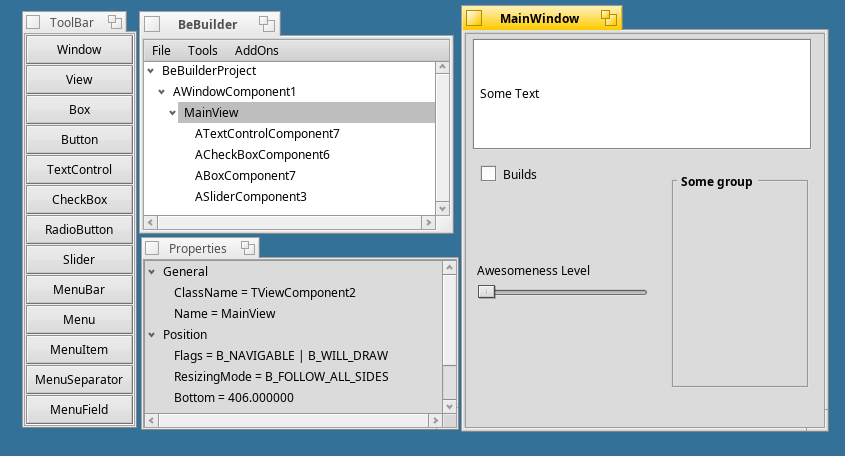

# BeBuilder
### by Jerome Fillon

### Build instructions
Navigate to the main source directory, and go to `V0.5.2BeBuilder`.
Then run `make`.

Hi all.

This night i have decided to release the source code of BeBuilder.

My decision has been made because of the need of a free GUI  Builder for BeOS to help developers to create GUI easily. Moreover i haven't found time these last weeks to update the source code of BeBuilder as i said to some users.

I hope that BeBuilder won't die and that people will help me to create a nice tool for every BeOS developer.

There are several main goals to achieve.
1) We need an interface with BeIDE to manage project.
2) We need a real editor a la Delphi, an editor with tabs and bookmarks. CoolCat could be cool.
3) We need to have more and more components. Some components embedded with BeOS are not easy to manage from a GUI builder like BeBuilder an exemple is the famous BTabView. It's quite easy to create components in BeBuilder, i will post an example of a led soon.

I don't have any "power trip" in mind when releasing the source code of BeBuilder. I have some ideas for the development of BeBuilder but anybody is free to add its own features and to release its own source code with BeBuilder, but he/she can't sell it. 
Only one thing can be sold: components or library of components.

I'm releasing the source code tonight, but there is some sweeping to do... the makefile or the BeIDE's project are supposed to compile and link but... who knows.... I haven't included any GPL paper yet.

Other ideas :

BeBuilder is open and should not use proprietary format to save its own data.... the project should be saved in a xml-like format. (see libglade in the linux world). 

BeBuilder should not rewrite what is available on BeOS like a debugger or a project manager, we must focus on the GUI builder stuff.

BeBuilder should be an open tool to let developers use it and stop using it if they want.

The code generation made in BeBuilder is quite tricky, but a C++ parser would be a bad idea and a too difficult idea for a small team, think simple first... but DO NOT THINK EASY!

If you have any questions concerning BeBuilder, the source code ... feel free to contact me at BeBuilder@bigfoot.com...

The bebuilder project will be hosted on my web site : http://www.softimedia.com for the moment.

BeOS needs cool application, we need cool developers, we need a cool opensource gui builder.

Be is giving its development tools for free to help developers, let's help developers too!

Jerome Fillon
Montreal, Quebec.
jerome at softimedia dot com

